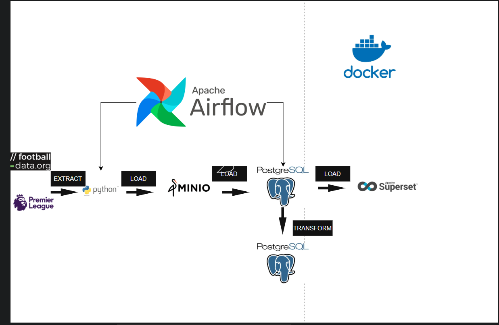
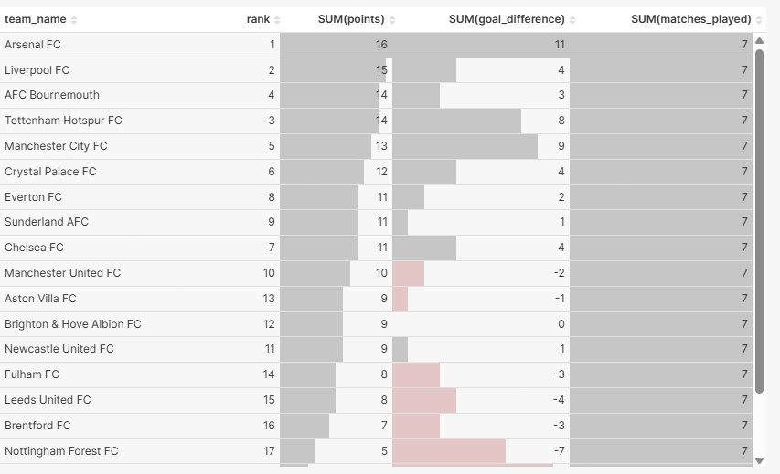

# 🏆 Football Data ETL Pipeline

This project is an **ETL data pipeline** built with **Apache Airflow**, **MinIO**, and **PostgreSQL** to extract, transform, and load **English Premier League** data.

---

## 🧱 Project Architecture

```
Football_data/
│
├── assets/
│   ├── bronze.py       # Extract data and upload to MinIO (Bronze Layer)
│   ├── silver.py       # Transform raw data into structured tables (Silver Layer)
│   ├── gold.py         # Aggregate and flatten data for analytics (Gold Layer)
│   ├── init_db.py      # Initialize PostgreSQL schemas and tables
│
├── get_data/
│   ├── fetch_matches.py     # Fetch data from Football API
│   ├── minio_client.py      # Helper functions to interact with MinIO
│   ├── load_from_minio.py   # Read JSON objects from MinIO
│
├── dags/
│   ├── orchestrator.py      # Airflow DAG orchestration
│   ├── gold_pipeline.py     # DAG to upload only from Silver → Gold layer
│
├── docker-compose.yml
├── requirements.txt
└── README.md
```

> **Data Source:** [football-data.org](https://www.football-data.org/)

---

## ⚙️ ETL Pipeline Overview

### 🥉 **1. Bronze Layer**

* Fetches raw football match data from the API.
* Stores **unprocessed JSON files** into **MinIO**.

### 🥈 **2. Silver Layer**

* Cleans, normalizes, and structures the JSON data.
* Writes to **PostgreSQL** tables:

  * `dev.silver_PL_team`
  * `dev.silver_PL_matches`

### 🥇 **3. Gold Layer**

* Aggregates and flattens match data for analytics.
* Generates advanced metrics and team standings.
* Tables:

  * `dev.gold_team_stats`
  * `dev.gold_league_standings`

---

## 🧩 Tech Stack

* **Python**
* **Apache Airflow**
* **MinIO**
* **PostgreSQL**
* **Docker Compose**

---

## 🚀 Getting Started

### 1️⃣ Run locally with Docker

```bash
docker-compose up -d
```

### 2️⃣ Initialize database (only once)

```bash
docker exec -it airflow-webserver python assets/init_db.py
```

### 3️⃣ Run ETL layers manually

```bash
docker exec -it airflow-webserver python assets/bronze.py
docker exec -it airflow-webserver python assets/silver.py
docker exec -it airflow-webserver python assets/gold.py
```

---

## 📊 Visualization

You can connect the **Gold Layer** tables to:

* **Apache Superset**
* **Metabase**
* **Power BI**

For interactive dashboards and analytics.

---

## 🖼️ Pipeline Diagrams & Output Samples

### ⚙️ System Architecture

 ⚽ DAG Orchestration


### 📈 League Standings Output



---

## 📅 Roadmap (Next Steps)

* [ ] Add team performance KPIs (xG, possession %, etc.)
* [ ] Automate data refresh via Airflow scheduling
* [ ] Integrate data quality checks (Great Expectations)
* [ ] Build dashboard in Superset

---

💡 *Developed for educational purposes by Football Data Analytics Team.*
